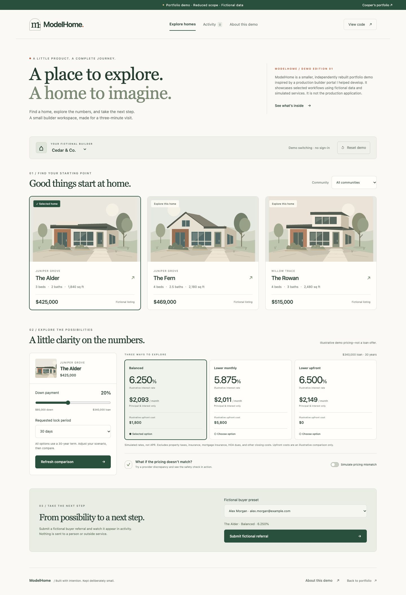
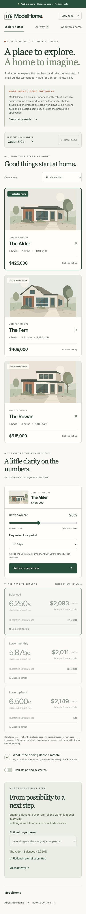

# ModelHome

**ModelHome is a smaller, independently rebuilt portfolio demo inspired by a production builder portal I helped develop. It showcases selected workflows using fictional data and simulated services. It is not the production application.**

Live: **https://cooperlockridge.com/projects/modelhome**

Independently implemented demonstration code inspired by professional experience. Newly written code, synthetic fixtures, and original SVG illustrations. This is a deliberate selection of common product concepts, not an export of a production portal.

## Three-minute walkthrough

**Select builder → choose home → compare pricing → simulate mismatch → restore valid pricing → submit fictional referral → inspect activity.**

Toggle “Simulate pricing mismatch,” compare again, and select “Test server rejection.” The provider returns a different lock period; the API refuses the referral. Turn off the simulation and compare again to continue. Reset clears the entire demo session for both builders.

## Run locally

Node.js 22 or newer recommended.

```sh
npm ci
npm run dev
# Open http://localhost:3000/projects/modelhome
```

Development has an explicitly local signing-key fallback. For production or `npm start`, generate a new secret with `openssl rand -hex 32` and set `MODELHOME_SESSION_SECRET` in your private environment. Never commit it. `.env.example` lists the required variable.

```sh
npm run typecheck
npm test
npm run build
npm start
```

## What works, what is simulated, what is omitted

| Implemented                                          | Simulated                                  | Intentionally omitted                                   |
| ---------------------------------------------------- | ------------------------------------------ | ------------------------------------------------------- |
| Two builder workspaces, three communities, six homes | All builders, homes, buyers and prices     | Production authentication and authorization             |
| Scenario controls and three pricing options          | Deterministic pricing provider             | Live mortgage APIs, underwriting, eligibility           |
| Preset buyer referral and scoped activity            | Referral submission stays inside this demo | Email, CRM, e-signatures, document processing           |
| Server validation and mismatch refusal               | A deliberate provider lock discrepancy     | Billing, transactions, analytics, operational reporting |
| Reset and visitor isolation                          | Fictional buyer presets at example.com     | Real personal data collection                           |

## Architecture

Next.js App Router, React, TypeScript, and Zod; no database, authentication provider, external asset service, or business API. The route `/api/demo` provides real UI-to-server requests. The browser receives synthetic inventory plus validated pricing and referral results.

- `src/components`: interface and original inline SVG homes.
- `src/domain`: types, synthetic fixtures, request validation, and pure illustrative calculations.
- `src/server`: mock provider, signed session/quote handling, tenant ownership, and action service.
- `src/app/api/demo`: HTTP boundary, JSON limits, origin validation, cookies, and no-store responses.
- `tests`: focused domain and HTTP behavior checks.

### Illustrative pricing

**Illustrative demo pricing—not a loan offer.**

The 30-day base interest rate is 6.25%; 45 days adds 0.125 percentage points and 60 days adds 0.25. The “Balanced” option uses that rate and $1,800 of illustrative upfront costs. “Lower monthly” subtracts 0.375 percentage points with $5,800 upfront; “Lower upfront” adds 0.25 points with $0 upfront. These invented tradeoffs are unrelated to live markets or lending decisions.

Loan principal is home price less the selected down payment. Payment uses ordinary fixed-payment amortization over 360 months: `P × r / (1 − (1 + r)^−360)`, where `r` is annual interest rate divided by 1,200. Payments are principal and interest only, not APR or a total housing payment. Taxes, insurance, mortgage insurance, HOA fees, and other closing costs are omitted. These calculations must not be used for financial decisions.

### Correctness and isolation

A namespaced HttpOnly, SameSite=Strict cookie is scoped to `/projects/modelhome`; it is Secure over HTTPS. Its signed payload holds an unpredictable visitor ID, nonce, expiration, and at most eight fictional referrals. Sessions expire after one hour. No shared mutable dataset or server-process memory is used as storage. Visitors with separate cookie jars cannot retrieve or overwrite one another’s referrals.

Builder switching is openly a demo feature, **not authentication**. Server handlers validate the tenant enum and home ownership; activity is filtered by the requested tenant. A quote signed for one tenant or visitor cannot be submitted in another context. Only fixed buyer IDs are accepted; arbitrary names or contact details are rejected.

Ten-minute signed quotes bind the scenario, home, visitor, nonce, tenant, and provider lock period. The server checks signatures, expiry, tenant ownership, and requested versus returned lock periods before accepting a referral, independently of client-side controls. Changing UI inputs invalidates the displayed quote. Submission and reset rotate the nonce. Reset also replaces the visitor ID and removes all fictional referrals.

Read-only actions do not rewrite existing session cookies. Where available, Web Locks serialize demo requests across tabs. Activity is reloaded when opened. Without Web Locks, concurrent mutations can have last-write-wins behavior. Tabs in the same browser share a cookie session. With no database, deliberate replay of a previously saved valid cookie cannot be centrally revoked, and simultaneous raw API submissions are not globally deduplicated. This is a bounded portfolio simulation, not a production identity or transaction system.

## Deployment integration

The app builds with `basePath: '/projects/modelhome'`. Its assets and API requests use this prefix. The separate static portfolio keeps its existing framework, root, resume, and API configuration. Two narrowly scoped external rewrites proxy the exact path and descendants to the standalone ModelHome deployment, preserving the prefix and visitor-facing URL.

```json
[
  {
    "source": "/projects/modelhome",
    "destination": "https://modelhome-portfolio-demo.vercel.app/projects/modelhome"
  },
  {
    "source": "/projects/modelhome/:path*",
    "destination": "https://modelhome-portfolio-demo.vercel.app/projects/modelhome/:path*"
  }
]
```

Use the confirmed production alias when configuring an independent deployment. Set a fresh production signing secret in hosting environment settings. No company credentials or services are needed. Never publish `.env*`, `.vercel`, build caches, or private inspection notes. Browser source maps are disabled.

## Verification and limitations

`npm test` covers input boundaries, tenant ownership, visitor isolation, quote tampering and expiry, mismatch refusal, referral submission, and reset. Type checking and the production build are separate commands. Browser verification includes desktop/mobile flow, keyboard controls, direct visits, refresh, and preservation of the portfolio root and resume.

The session is browser-local and expires; it is not durable storage or cross-device sync. Scenario selections reset on page refresh, while accepted referrals remain until reset or expiry. No production metrics, scale claims, or full production feature parity are implied.

## Screenshots

Captured from this independently implemented demo only.



